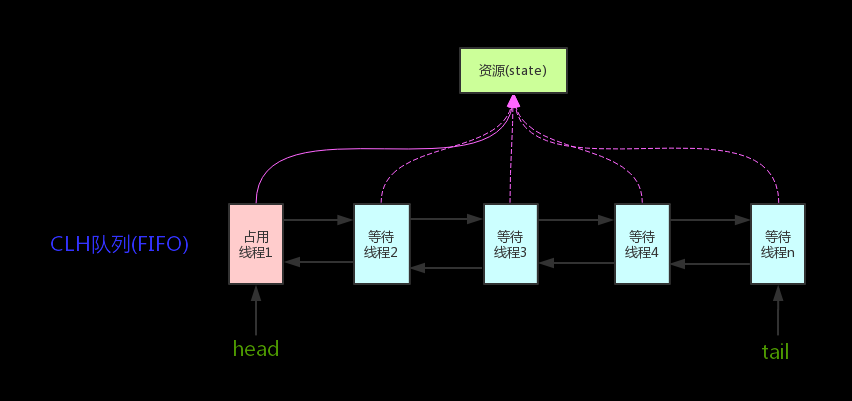
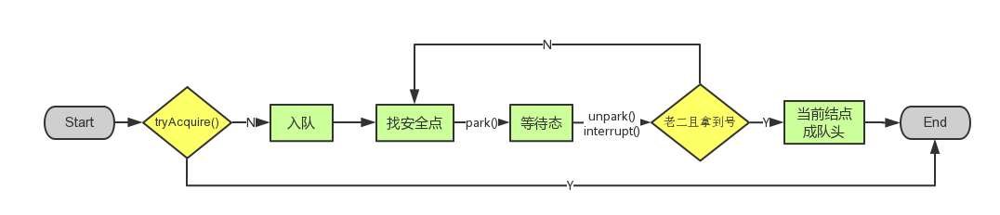

# 1. AQS抽象类



它维护了一个 volatile int state（代表共享资源）和一个 FIFO 线程等待队列（多线程争用资源被阻塞时会进入此队列）。这里 volatile 是核心关键词，具体 volatile 的语义，在此不述。state 的访问方式有三种:

* `getState()`
* `setState()`
* `compareAndSetState()`

AQS定义两种资源共享方式：Exclusive（独占，只有一个线程能执行，如ReentrantLock）和Share（共享，多个线程可同时执行，如Semaphore | CountDownLatch）

不同的自定义同步器争用共享资源的方式也不同。**自定义同步器在实现时只需要实现共享资源state的获取与释放方式即可**，至于具体线程等待队列的维护（如获取资源失败入队/唤醒出队等），AQS已经在顶层实现好了。自定义同步器实现时主要实现以下几种方法：

* `isHeldExclusively()`：该线程是否正在独占资源。只有用到 condition 才需要去实现它。
* `tryAcquire(int)`：独占方式。尝试获取资源，成功则返回 true，失败则返回 false。
* `tryRelease(int)`：独占方式。尝试释放资源，成功则返回 true，失败则返回 false。
* `tryAcquireShared(int)`：共享方式。尝试获取资源。负数表示失败；0 表示成功，但没有剩余可用资源；正数表示成功，且有剩余资源。
* `tryReleaseShared(int)`：共享方式。尝试释放资源，如果释放后允许唤醒后续等待结点返回true，否则返回false。

以ReentrantLock为例，state初始化为 0，表示未锁定状态。A 线程`lock()`时，会调用`tryAcquire()`独占该锁并将 state + 1。此后，其他线程再`tryAcquire()`时就会失败，直到 A线程`unlock()`到 state=0（即释放锁）为止，其它线程才有机会获取该锁。当然，释放锁之前，A线程 自己是可以重复获取此锁的（state 会累加），这就是可重入的概念。但要注意，获取多少次就要释放多么次，这样才能保证 state 是能回到零态的。

再以 CountDownLatch 以例，任务分为 N 个子线程去执行，state 也初始化为 N（注意 N 要与线程个数一致）。这 N 个子线程是并行执行的，每个子线程执行完后`countDown()`一次，state 会 CAS 减 1。等到所有子线程都执行完后(即 state = 0 )，会`unpark()`主调用线程，然后主调用线程就会从`await()`函数返回，继续后余动作。

一般来说，自定义同步器要么是独占方法，要么是共享方式，他们也只需实现 `tryAcquire-tryRelease`、`tryAcquireShared-tryReleaseShared`中的一种即可。但AQS也支持自定义同步器同时实现独占和共享两种方式，如 ReentrantReadWriteLock。

# 2. 源码解析

依照`acquire-release`、`acquireShared-releaseShared`的次序来解析AQS的源码

## 2.1 结点状态 waitStatus

Node结点是对每一个等待获取资源的线程的封装，其包含了需要同步的线程本身及其等待状态，如是否被阻塞、是否等待唤醒、是否已经被取消等。变量waitStatus则表示当前Node结点的等待状态，共有5种取值 CANCELLED、SIGNAL、CONDITION、PROPAGATE、0。

- **CANCELLED**(1)：表示当前结点已取消调度。当 timeout 或被中断（响应中断的情况下），会触发变更为此状态，进入该状态后的结点将不会再变化。
- **SIGNAL**(-1)：表示后继结点在等待当前结点唤醒。后继结点入队时，会将前继结点的状态更新为 SIGNAL。
- **CONDITION**(-2)：表示结点等待在 Condition 上，当其他线程调用了 Condition 的 signal() 方法后，CONDITION 状态的结点将**从等待队列转移到同步队列中**，等待获取同步锁。
- **PROPAGATE**(-3)：共享模式下，前继结点不仅会唤醒其后继结点，同时也可能会唤醒后继的后继结点。
- **0**：新结点入队时的默认状态。

注意，**负值表示结点处于有效等待状态，而正值表示结点已被取消。所以源码中很多地方用>0、<0来判断结点的状态是否正常**。

## 2.1 acquire(int)

此方法是独占模式下线程获取共享资源的顶层入口。如果获取到资源，线程直接返回，否则进入等待队列，直到获取到资源为止，且整个过程忽略中断的影响。这也正是`lock()`的语义，当然不仅仅只限于`lock()`。获取到资源后，线程就可以去执行其临界区代码了。下面是`acquire()`的源码：

```java
public final void acquire(int arg) {
    if (!tryAcquire(arg) &&
        acquireQueued(addWaiter(Node.EXCLUSIVE), arg))
        selfInterrupt();
}
```

函数流程如下：

1. `tryAcquire()`尝试直接去获取资源，如果成功则直接返回（这里体现了非公平锁，每个线程获取锁时会尝试直接抢占加塞一次，而 CLH队列 中可能还有别的线程在等待
2. `addWaiter()`将该线程加入等待队列的尾部，并标记为独占模式；
3. `acquireQueued()`使线程阻塞在等待队列中获取资源，一直获取到资源后才返回。如果在整个等待过程中被中断过，则返回true，否则返回false。
4. 如果线程在等待过程中被中断过，它是不响应的。只是获取资源后才再进行自我中断`selfInterrupt()`，将中断补上。

### 2.1.1 tryAcquire(int)

此方法尝试去获取独占资源。如果获取成功，则直接返回true，否则直接返回false。这也正是tryLock()的语义，还是那句话，当然不仅仅只限于tryLock()。如下是tryAcquire()的源码：

```java
protected boolean tryAcquire(int arg) {
    throw new UnsupportedOperationException();
}
```

AQS这里只定义了一个接口，具体资源的获取交由自定义同步器去实现了（通过 state 的 get/set/CAS ）！至于能不能重入，能不能加塞，那就看具体的自定义同步器怎么去设计了！当然，自定义同步器在进行资源访问时要考虑线程安全的影响。

这里之所以没有定义成abstract，是因为独占模式下只用实现tryAcquire-tryRelease，而共享模式下只用实现tryAcquireShared-tryReleaseShared。如果都定义成abstract，那么每个模式也要去实现另一模式下的接口。说到底，Doug Lea 还是站在咱们开发者的角度，尽量减少不必要的工作量。

### 2.1.2 addWaiter(Node)

此方法用于将当前线程加入到等待队列的队尾，并返回当前线程所在的结点:

```java
private Node addWaiter(Node mode) {
    //以给定模式构造结点。mode有两种：EXCLUSIVE（独占）和SHARED（共享）
    Node node = new Node(Thread.currentThread(), mode);

    //尝试快速方式直接放到队尾。
    Node pred = tail;
    if (pred != null) {
        node.prev = pred;
        if (compareAndSetTail(pred, node)) {
            pred.next = node;
            return node;
        }
    }

    //上一步失败则通过enq入队。
    enq(node);
    return node;
}
```

#### 2.1.2.1 enq(Node)

```java
private Node enq(final Node node) {
    //CAS"自旋"，直到成功加入队尾
    for (;;) {
        Node t = tail;
        if (t == null) { // 队列为空，创建一个空的标志结点作为head结点，并将tail也指向它。
            if (compareAndSetHead(new Node()))
                tail = head;
        } else {//正常流程，放入队尾
            node.prev = t;
            if (compareAndSetTail(t, node)) {
                t.next = node;
                return t;
            }
        }
    }
}
```

### 2.1.3 acquireQueued(Node, int)

通过tryAcquire()和addWaiter()，该线程获取资源失败，已经被放入等待队列尾部了，那么下一步就是：**进入等待状态休息，直到其他线程彻底释放资源后唤醒自己，自己再拿到资源，然后就可以去干自己想干的事了**。`acquireQueued()`就是干这件事：**在等待队列中排队等待资源（中间没其它事干可以休息），直到拿到资源后再返回**。这个函数非常关键，源码如下:

```java
final boolean acquireQueued(final Node node, int arg) {
    boolean failed = true; // 标记是否成功拿到资源
    try {
        boolean interrupted = false; // 标记等待过程中是否被中断过

        //自旋
        for (;;) {
            final Node p = node.predecessor();//拿到前驱
            //如果前驱是head，即该结点已成老二，
            //那么便有资格去尝试获取资源（可能是老大释放完资源唤醒自己的，当然也可能被interrupt了）。
            if (p == head && tryAcquire(arg)) {
                setHead(node); // 拿到资源后，将head指向该结点。所以head所指的标杆结点，就是当前获取到资源的那个结点或null。
                p.next = null; // setHead中node.prev已置为null，此处再将head.next置为null，
                			   // 就是为了方便GC回收以前的head结点。也就意味着之前拿完资源的结点出队了！
                failed = false; // 成功获取资源
                return interrupted; // 返回等待过程中是否被中断过
            }

            // 如果自己可以休息了，就通过park()进入waiting状态，直到被unpark()。
            // 如果不可中断的情况下被中断了，那么会从park()中醒过来，发现拿不到资源，从而继续进入park()等待。
            if (shouldParkAfterFailedAcquire(p, node) &&
                parkAndCheckInterrupt())
                interrupted = true;//如果等待过程中被中断过，哪怕只有那么一次，就将interrupted标记为true
        }
    } finally {
        if (failed) // 如果等待过程中没有成功获取资源（如timeout，或者可中断的情况下被中断了），那么取消结点在队列中的等待。
            cancelAcquire(node);
    }
}
```

到这里，先不急着总结`acquireQueued()`的函数流程，先看看`shouldParkAfterFailedAcquire()`和`parkAndCheckInterrupt()`具体干些什么。

#### 2.1.3.1 shouldParkAfterFailedAcquire(Node, Node)

此方法主要用于检查状态，看看自己是否真的可以去休息了（线程进入 waiting 状态），防止队列前面的线程都放弃了

```java
private static boolean shouldParkAfterFailedAcquire(Node pred, Node node) {
    int ws = pred.waitStatus;//拿到前驱的状态
    if (ws == Node.SIGNAL)
        //如果已经告诉前驱拿完号后通知自己一下，那就可以安心休息了
        return true;
    if (ws > 0) {
        /*
           * 如果前驱放弃了，那就一直往前找，直到找到最近一个正常等待的状态，并排在它的后边。
           * 注意：那些放弃的结点，由于被自己“加塞”到它们前边，它们相当于形成一个无引用链，稍后就会被GC回收
          */
        do {
            node.prev = pred = pred.prev;
        } while (pred.waitStatus > 0);
        pred.next = node;
    } else {
        //如果前驱正常，那就把前驱的状态设置成SIGNAL，告诉它拿完号后通知自己一下。有可能失败，人家说不定刚刚释放完呢！
        compareAndSetWaitStatus(pred, ws, Node.SIGNAL);
    }
    return false;
}
```

整个流程中，如果前驱结点的状态不是SIGNAL，那么自己就不能进入 waiting，需要去找个可以 waiting 的点，同时再尝试下看有没有机会轮到自己拿号。

#### 2.1.3.2 parkAndCheckInterrupt()

如果线程找好安全休息点后，那就可以安心去休息了。此方法就是让线程去休息，真正进入等待状态

```java
private final boolean parkAndCheckInterrupt() {
    LockSupport.park(this);//调用park()使线程进入waiting状态
    return Thread.interrupted();//如果被唤醒，查看自己是不是被中断的。
}
```

`park()`会让当前线程进入waiting状态。在此状态下，有两种途径可以唤醒该线程：1.被`unpark()`；2.被`interrupt()`。需要注意的是，`Thread.interrupted()`会清除当前线程的中断标记位。 

#### 2.1.3.3 小结

看了`shouldParkAfterFailedAcquire()`和`parkAndCheckInterrupt()`，现在让我们再回到`acquireQueued()`，总结下该函数的具体流程：

1. 结点进入队尾后，检查状态，找到安全休息点；
2. 调用`park()`进入waiting状态，等待`unpark()`或`interrupt()`唤醒自己；
3. 被唤醒后，看自己是不是有资格能拿到号。如果拿到，head指向当前结点，并返回从入队到拿到号的整个过程中是否被中断过；如果没拿到，继续流程1

### 2.1.4 小结

`acquireQueued()`分析完之后，接下来再回到`acquire()`, 再贴上它的源码：

```java
public final void acquire(int arg) {
    if (!tryAcquire(arg) &&
        acquireQueued(addWaiter(Node.EXCLUSIVE), arg))
        selfInterrupt();
}
```

再来总结下它的流程：

1. 调用自定义同步器的`tryAcquire()`尝试直接去获取资源，如果成功则直接返回；
2. 没成功，则`addWaiter()`将该线程加入等待队列的尾部，并标记为独占模式；
3. `acquireQueued()`使线程在等待队列中休息，有机会时（轮到自己，会被`unpark()`）会去尝试获取资源。获取到资源后才返回。如果在整个等待过程中被中断过，则返回 true，否则返回 false。
4. 如果线程在等待过程中被中断过，它是不响应的。只是获取资源后才再进行自我中断`selfInterrupt()`，将中断补上。

由于此函数是重中之重，再用流程图总结一下：



至此，`acquire()`的流程算是告一段落了。这也就是`ReentrantLock.lock()`的流程